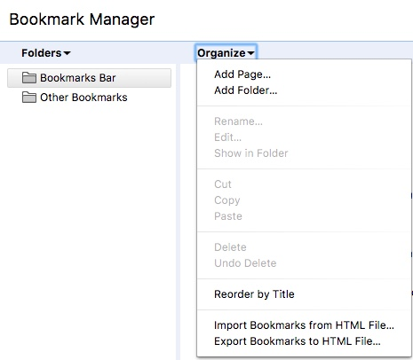

Turkey Bowl
===========

This API exists to store data given to it by a chrome bookmarklet. The bookmarklet is run on a Yahoo Fantasy Football team roster page to get score information of their starting players

Install:
----------------

- Clone Repo
```
cd fantasy-turkeybowl
composer install
php artisan migrate --seed
```

Add Bookmarklet:
----------------

Navigate to resources/assets/js/bookmarklet.js. Update the ‘baseAPIUrl’ on line 2 to the server url. Copy the contents.

In Chrome, open your Bookmark manager and ‘Add Page’ to your Bookmark Bar



Name the bookmark and paste the bookmarklet.js contents in there

Now you can run that bookmark on a team’s fantasy team page and it’ll store the stats of the week you’re viewing!

Notes
----------------

This system does not currently store historical data. If a bookmark sends data for a team, it erases what it had for the given week and replaces it
